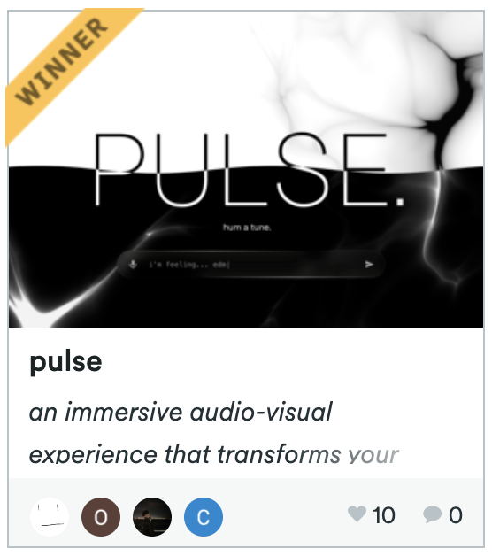

# pulse

an immersive audio-visual experience that transforms your hums into music. top-voted people's choice winner at cornell's bigredhacks 2025. click on the gif below for a full demo on [youtube](https://www.youtube.com/watch?v=bwiFqrOQw84)!

| dubs | demo & ui/ux |
| :---: | :---: |
|  |  |

## about

### what it does

pulse transforms your random musical thoughts into real-time audiovisual experiences. users hum into our interface, and pulse instantly generates a continuous stream of music that responds to whatever direction they want. as users type stuff like "add jazz piano" or "make it more chill" both the music and visuals evolve in real-time.

... read more on the [devpost](https://devpost.com/software/pulse-4rpujf)!

also if your prompt is bad then the model will default to dubstep. sorry.